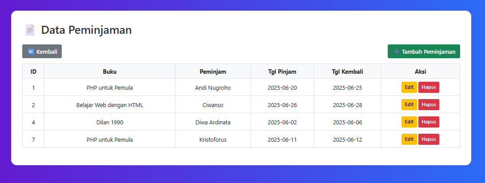

# 📚 Proyek Perpustakaan Sederhana

Aplikasi Perpustakaan Sederhana adalah proyek web dinamis berbasis PHP native yang dirancang untuk memudahkan pengelolaan data buku dan transaksi peminjaman buku di lingkungan sekolah, kampus, atau instansi kecil. Proyek ini dikembangkan sebagai bagian dari tugas **UAS Teknologi Web Semester Genap Tahun 2025**.

Aplikasi ini memiliki fitur utama seperti login user, CRUD buku dan peminjaman, validasi form, cetak laporan ke PDF menggunakan Dompdf, serta desain antarmuka responsif menggunakan Bootstrap 5. Dengan adanya fitur validasi tanggal dan pembatasan logika seperti buku tidak dapat dihapus jika sedang dipinjam, aplikasi ini juga menekankan aspek keamanan dan kemudahan pengguna (user experience).

---

## 🛠️ Teknologi yang Digunakan

| Teknologi    | Deskripsi                                                                 |
|--------------|---------------------------------------------------------------------------|
| PHP Native   | Digunakan sebagai bahasa pemrograman backend tanpa framework tambahan     |
| MySQL        | Basis data relasional untuk menyimpan data buku, peminjam, dan transaksi  |
| Bootstrap 5  | Framework CSS untuk membuat tampilan responsif dan modern                 |
| HTML5        | Struktur dasar halaman web                                                |
| CSS3         | Styling tambahan untuk antarmuka form dan dashboard                       |
| JavaScript   | Validasi interaktif (tanggal kembali ≥ tanggal pinjam)                   |
| Dompdf       | Library PHP untuk mencetak laporan buku & peminjaman ke format PDF        |

---

## ✅ Fitur Utama

- 🔐 Login Pengguna dengan hash MD5
- 📘 CRUD Data Buku
- 📄 CRUD Data Peminjaman (berelasi dengan Buku)
- 🖨️ Cetak Laporan PDF (Buku & Peminjaman)
- ✅ Validasi Form & Tanggal (server & client-side)
- 📱 Tampilan Responsif dengan Bootstrap 5

## ✨ Fitur Tambahan

- 🔔 Notifikasi sukses tambah/edit/hapus data
- 📂 Struktur folder rapi dan mudah dikembangkan

---

## 🚀 Cara Menjalankan Aplikasi

1. Login menggunakan username dan password yang valid
2. Setelah login, pengguna akan diarahkan ke dashboard utama
3. Di halaman dashboard, pengguna bisa mengakses:
   - Manajemen Buku
   - Data Peminjaman
   - Cetak Laporan Buku
   - Cetak Laporan Peminjaman
   - Logout
4. Di halaman Manajemen Buku:
   - Lihat daftar buku (judul, pengarang, stok)
   - Tambah, edit, dan hapus data buku
5. Di halaman Data Peminjaman:
   - Lihat daftar peminjam dan detail pinjaman
   - Tambah, edit, dan hapus peminjaman
6. Di halaman Cetak Laporan:
   - Laporan Buku dan Peminjaman bisa dicetak ke PDF
7. Gunakan tombol Logout untuk keluar dari sistem

---

## 🖼️ Tampilan Aplikasi

### 🔐 Halaman Login

### 🏠 Halaman Dashboard

### 📚 Halaman Manajemen Buku

### ➕ Halaman Tambah Buku

### ✏️ Halaman Edit Buku

### 📄 Halaman Data Peminjaman

### ➕ Halaman Tambah Peminjaman

### ✏️ Halaman Edit Peminjaman

### 🖨️ Halaman Cetak Laporan Buku

### 🖨️ Halaman Cetak Laporan Peminjaman

